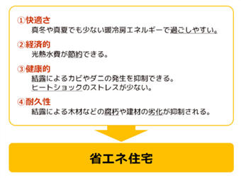
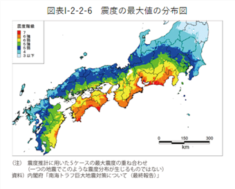

## 住まいを快適にするには

一番長く時間を過ごすであろう場所を快適にしたい、または「ホッと」する場所にしたい、という思いは誰しもあろうかと思います。

経済産業省 資源エネルギー庁が[省エネポータルサイト](https://www.enecho.meti.go.jp/category/saving_and_new/saving/general/housing/)を開設しているので覗いてみて下さい。

政府主導の「省エネルギー住宅」とは

> 「断熱」と「日射遮蔽」により、冬は「部屋の中の暖かい空気が逃げず、部屋内や部屋間の室温がほぼ均一の家」「北側の風呂もトイレも寒くなく、結露もしない家」、夏は「室外からの熱気が入らずに涼しい家」「小型のエアコンでも良く効き、朝・夕は風通しの良い家」が実現できます。つまり、「省エネルギー住宅」＝「快適な住宅」であるといえます。

と定義しています。

断熱性能を示す値で UA値というものがあり、良くダウンのような厚着に例えられますが、断熱性能の高い断熱材を分厚くすればするほど値は小さくなります。

この UA値は 0.5以下を目標に施工しています。

※ 一条工務店2x6工法 i-smart で 0.26, 住友林業2.6工法で 0.43, ミサワホーム 木造軸組 MJWOOD ZEH 仕様で 0.55 の UA値になります。

家にどのくらいの隙間があるかを示す値では C値という指標があり、気密がどのくらい取れているかを確認できます。上に示した断熱性能がいくら良くても、隙間が多いとせっかく室内で温めた（冷やした）空気は外へ流れていってしまいます。また、計画換気も行われず室内の空気が澱んでしまいます。

この C値は 1以下を目標に施工しています。

上記を実現するための仕様として、弊社では次の仕様を標準としてご提案しています。

※ 予算とご相談の上適宜スペックアップ、ダウンを行います。

前提条件: 建築地域は6地域を想定

- 工法: 木造在来軸組み, べた基礎
- 耐震: 許容応力度計算による等級3
- 気密: C値 1.0 以下目標
- 屋根断熱材: グラスウール14K 1550mm
- 壁断熱材: グラスウール14K 850mm
- 床断熱材: グラスウール14K 800mm
- 浴室断熱材: スタイロフォーム 500mm (立ち上がり)
- 窓: YKK AP 330 複層樹脂, シャノンウインドIIs 複層樹脂
- 換気: ダクト排気型3種換気 (トイレ, 浴室も換気経路とする)
- 玄関ドア: YKK AP K3グレード断熱ドア
- 防蟻: 基礎・配管隙間へ防蟻薬剤処理
- ルーフィング, 透湿防水シート: xxx
- 気密シート: 可変透湿気密シート

また、マグニチュード8-9クラスの地震が発生する南海トラフ地震は、 [30年以内の発生確率が70-80% (2020/01/24 時点)](https://www.mlit.go.jp/hakusyo/mlit/r01/hakusho/r02/html/n1222000.html) とされています。

また、首都直下地震については、想定されるマグニチュード7程度の地震の [30年以内の発生確率は、70％程度（2020年1月24日時点）](https://www.mlit.go.jp/hakusyo/mlit/r01/hakusho/r02/html/n1222000.html) とされています。

これから家を建てられる若い方は上記の大地震に巻き込まれる可能性が高いです。このような大地震が発生した場合、耐震等級2以下では再居住が難しいレベルまで倒壊する可能性があります。

震度7の地震が連続で発生したとしても、住み続けられるのは耐震等級3の家だけです。

構造物の計算は壁量計算、許容応力度計算、型式認定という３つの種類がありますが、できれば耐震等級3で、許容応力度計算とさせて下さい。
