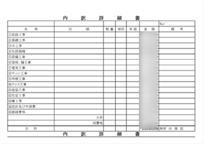

## ご相談・お問い合わせ

はじめての家づくり／リフォームで何から始めてよいか分からない方が多いと思います。

- 先ずは何から始めればよいのか
- 施工会社の決め方
- 原田建設で建てる家はどのような家か
- 家の「性能」とは

どのようなご相談でも問題ありません。
先ずはメールか電話にてお問合せ下さい。現在の状況やご心境、ご希望、将来的な見通しまで含め詳細を伺い、弊社がいただいた不安・疑問点を解消していきます。

## 土地探し

希望のエリアや広さ、条件等、お客様のご要望を伺い、ご予算を踏まえた「最適」を実現できる土地を探していきます。

実際に土地をご確認いただき、疑問点等を改めて確認し、認識のズレを是正しつつ最初の行程で失敗しないよう可能な限りご提案させていただきます。

## ヒアリング・プランのご提案

お客様へ入念にヒアリングさせていただき、ご要望やご相談内容を基にデザイン・素材・性能・間取り・設備等をご提案させていただきます。

ご提案したプランを検討いただき、不安点や疑問点等を改めて伺います。

設計時のちょっとしたアイデアが理想の注文住宅、リフォームを実現するきっかけになります。

照明はオーデリック、システムキッチンやユニットバスはクリナップ、サッシは YKK AP 等、実際の展示場に足を運び実物を見たり仕様を聞くことで、より具体的な暮らしのイメージに繋がります。

## お見積り

ご要望と打ち合わせ内容を基に、お見積りについてご提案いたします。

通常、2～4週間程お時間をいただいております。

以下、お見積りのイメージになります。

## ご契約

設計、資金計画を踏まえてご提案内容に納得いただければ、契約をさせていただきます。

## 地鎮祭

## 着工

## 上棟

## お施主様立会会

## お引渡し

## お引越し