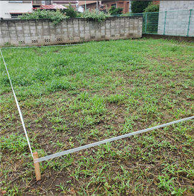

## ご相談・お問い合わせ

はじめての家づくり／リフォームで何から始めてよいか分からない方が多いと思います。

- 先ずは何から始めればよいのか
- 施工会社の決め方
- 原田建設で建てる家はどのような家か
- 家の「性能」とは

どのようなご相談でも問題ありません。
先ずはメールか電話にてお問合せ下さい。現在の状況やご心境、ご希望、将来的な見通しまで含め詳細を伺い、弊社がいただいた不安・疑問点を解消していきます。

## 土地探し

希望のエリアや広さ、条件等、お客様のご要望を伺い、ご予算を踏まえた「最適」を実現できる土地を探していきます。

実際に土地をご確認いただき、疑問点等を改めて確認し、認識のズレを是正しつつ最初の行程で失敗しないよう可能な限りご提案させていただきます。

## ヒアリング・プランのご提案

お客様へ入念にヒアリングさせていただき、ご要望やご相談内容を基にデザイン・素材・性能・間取り・設備等をご提案させていただきます。

ご提案したプランを検討いただき、不安点や疑問点等を改めて伺います。

設計時のちょっとしたアイデアが理想の注文住宅、リフォームを実現するきっかけになります。

※ 設計時に設計着手金等の料金を先払いする必要はございません。

照明はオーデリック、システムキッチンやユニットバスはクリナップ、サッシは YKK AP 等、実際の展示場に足を運び実物を見たり仕様を聞くことで、より具体的な暮らしのイメージに繋がります。担当者にお繋ぎしますので、お気軽にご相談下さい。

## お見積り

ご要望と打ち合わせ内容を基に、お見積りについてご提案いたします。

通常、2～4週間程お時間をいただいております。

以下、お見積りのイメージになります。

## ご契約

設計、資金計画を踏まえてご提案内容に納得いただければ、契約をさせていただきます。

## 地鎮祭

着工する前に、お施主様の土地で地鎮祭を行います。地鎮祭とは、建築工事が無事に終わるよう神主を招いて安全祈願する儀式のことです。土地を守る氏神様に土地を利用させてもらう許可を得て、工事の安全を祈願します。

弊社では創業より [氷川神社](https://tesshow.jp/saitama/sayamairuma/shrine_takakra_hikawa.html) に地鎮祭をお願いしております。

晴天時を見計らって通常実施しますが、当日予期せず雨天になった場合は氷川神社にて地鎮祭を行います。

※ 用意いただくものは、水、塩、米、野菜、魚です。お酒は弊社側で用意します。

[建築吉日カレンダー](https://sumai.panasonic.jp/sumu2/calendar/) というカレンダーがあり、建築吉日に新築工事や増改築工事を始めると縁起がよいとされています。

## 地盤調査

建築工事前に、地盤調査と呼ばれる、土地の強度、地耐力を調査します。

地盤調査の結果、土地改良が必要な場合は地盤改良が必要です。

## 建築確認申請・認可

建築関係法令に建築する建造物が適合しているかを着工前に行政機関に審査してもらいます。

申請のための建築確認書の作成、手続きを行い、確認済証の交付を受けます。

交付までおよそ一カ月程度かかります。

## 着工

いよいよ工事が開始します。

弊社では新築工事においては在来工法を採用しています。

在来工法は日本の伝統的な工法で、木材で土台、柱、梁の軸組みを作る工法です。開口部を広く取り、設計の自由度も高くなっています。

※ その他の工法は環境省の [付録1 住宅構造の分類](https://www.env.go.jp/content/900405122.pdf) を参照下さい。

## 基礎作り

弊社では「ベタ基礎」を採用しています。

ベタ基礎は、床全体が基礎となっており建物を支える範囲が広く建物の沈下が起こりにくく、木材の腐食やシロアリも入り辛い基礎になっています。

## 上棟

柱・梁を組み立てた後に、屋根の一番高い位置に棟木横架材が取り付けられることを上棟や棟上げといいます。

住宅の骨格が組みあがっていき、「家」の実感が出てきます。棟上げの様子をタイムラプス撮影するのも良いかもしれません。

## 上棟式

上棟式（別名：棟上げ式）は、家屋と大工の神を祀り、棟上げを無事に終えられたことを感謝し工事の安全を祈る儀式です。

上棟式のスケジュールは例として次のようになります。

- 08:15 集合
- 08:20 清めの乾杯
- 08:30 作業開始
- お昼頃上棟
- 四方固め(建物の四隅に酒、塩、米を撒く)

## 構造検査

第三者機関により基礎から完成まで、工期中に計４回検査が実施されます。

## 施主検査 (施主確認)

仕様通りに丁寧に建築を行い、傷の有無、建具の開閉等は弊社がしっかりと確認していますが、念のため見落としがないかお施主様からのチェックをしていただきます。

家の隅々までチェックし、主に次の事項をご確認いただければと思います。

- 扉の開閉がスムーズか
- 窓の開閉がスムーズか
- クロスの剥がれが無いか
- 床板の隙間はないか
- 床や天井、壁に傷はないか
- 照明は全て点灯するか
- 給排気がしっかりと機能しているか

気になるポイントはマスキングテープでマーキングします。

※ 新居へ住んでからの傷は責任の所在が曖昧になる場合があります。弊社としても隅々まで確認はしておりますが、見落としが無いか今一度ご確認いただきたいポイントです。

## お引き渡し

お施主様の確認後、いよいよお引き渡しとなります。

新居の鍵と以下の書類をお渡しします。

- 瑕疵担保責任保険の書類
  - 2000年4月に「住宅の品質確保の促進等に関する法律」が施行され、建築会社は建築した住宅を引渡しから10年間の間、瑕疵担保責任を負うことになりました。
  - 瑕疵担保責任とは、引き渡された住宅に仕様通りの施工、性能が行われていない場合に、建築会社側がその責任を負う制度です。
- 建具、照明、設備関連のマニュアル
- 建具、照明、設備関連の保証書

お荷物が入る前の綺麗な状態を、たくさん写真に残しておくと良いかもしれません。

## アフターメンテナンス

建てて終わりではなく、暮らした後が重要です。お引き渡しの後も、新築した住宅に異常があればサポートさせていただきます。

※ クロスの割れ、床の隙間の広がり等、木造住宅では木の収縮によってはどうしても発生してしまいます。その場合は補修いたしますので遠慮なくご相談下さい。

